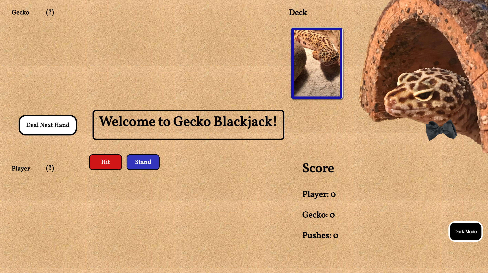
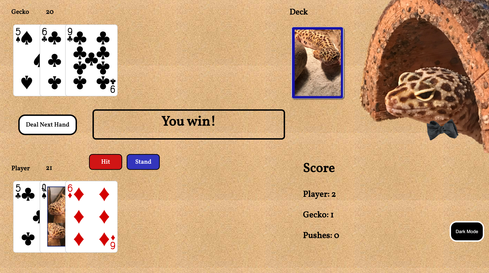
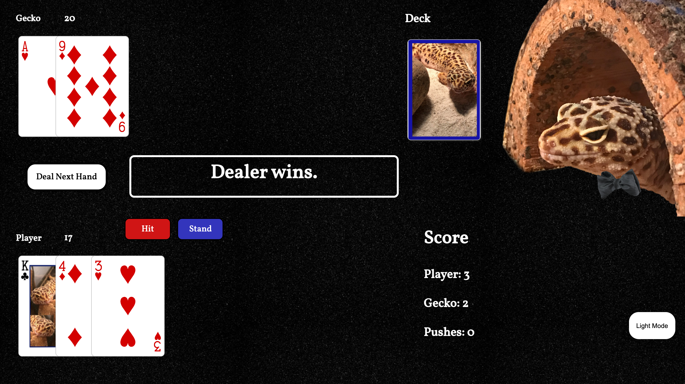

# Leopard Gecko Blackjack #

Welcome to the game of blackjack with a leopard gecko theme.

## Getting Started ##
https://gecko-blackjack.netlify.app/

This is a single-player game, where the user plays against the dealer.

To begin playing, click on the "Deal Next Hand" button. This will assign two cards each to the player and dealer.

You will have the choice to select "Hit" or "Stand". If you choose "Hit", you will be given one additional card. If you choose "Stand", it will be the dealer's turn to either hit or stand.

The winner of the turn is the player whose cards total closest to 21, without going over. If you choose hit and go over 21, you lose the turn immediately.

The dealer will always hit with 16 or less, and will always stand with 17 or more.

If the player and dealer have the same total, the turn is pushed.

## Screenshots ##

### Welcome ###

### Close one ###

### Dark Mode ###

## Technologies Used ##
* Javascript
* HTML
* CSS

## Next steps ##
Improve style with fonts, colors, animations, sounds, etc.